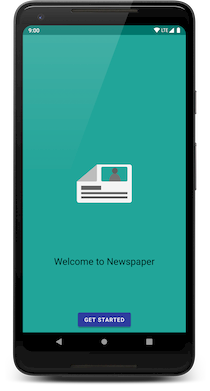
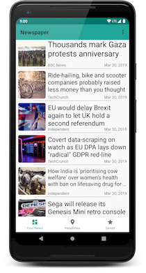
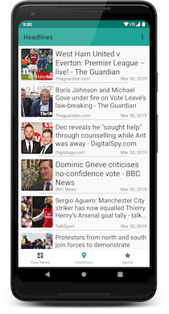
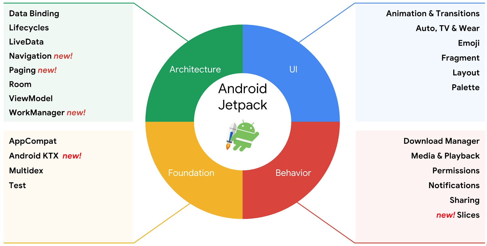

# Newspaper
A (mostly) material design complient news app that lets you choose what you want to be updated about. News provided by [newsapi.org](https://newsapi.org/)

   

## Libraries Used

This app is (kinda) built upon [Android Jetpack](https://developer.android.com/jetpack), a collection of Android software components that encourages modern software design practices (like separation of concerns & testing).

* Third Party
  * [Glide](https://github.com/bumptech/glide) - For easy image loading
  * [Retrofit](https://github.com/square/retrofit) - For a type-safe & object based HTTP client
* Android Jetpack
  * [AppCompat](https://developer.android.com/topic/libraries/support-library/packages.html#v7-appcompat) - Degrade gracefully on older versions of Android
  * [LiveData](https://developer.android.com/topic/libraries/architecture/livedata) - Notify views when underlying database changes (which itself implements [Lifecycles](https://developer.android.com/topic/libraries/architecture/lifecycle))
  * [Navigation](https://developer.android.com/topic/libraries/architecture/navigation.html) - Handle everything needed for in-app navigation
  * [Room](https://developer.android.com/topic/libraries/architecture/room) - Fluent SQLite database access
  * [ViewModel](https://developer.android.com/topic/libraries/architecture/viewmodel) - Manage UI-related data in a lifecycle-conscious way
  * [WorkManager](https://developer.android.com/topic/libraries/architecture/workmanager) - Manages Android background jobs
